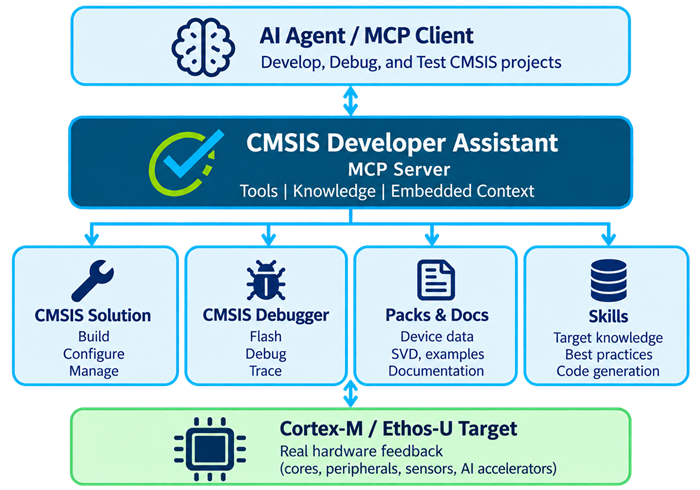
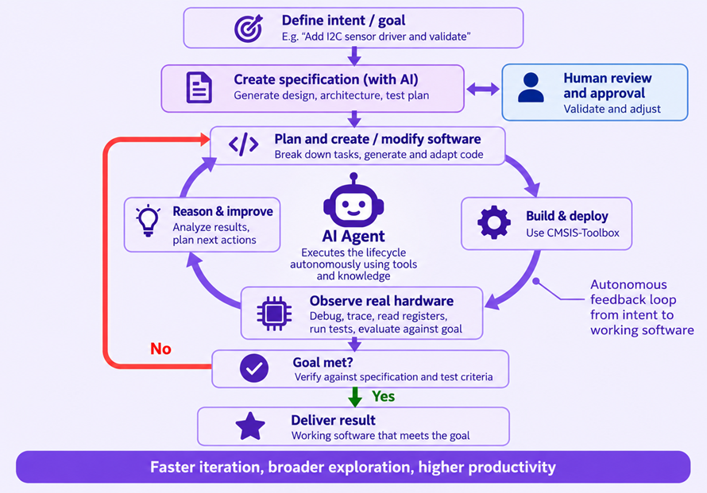

# CMSIS Developer Assistant

The CMSIS Developer Assistant gives an AI agent controlled access to the CMSIS build
system, debugger, target registers, project documentation, and connected
hardware. The AI agent becomes more than a code generator: it can participate in
the complete embedded development lifecycle while you remain in control.

Traditional embedded development is a human-driven loop: understand the
requirements, configure the project, write code, build, flash, debug, analyze,
and repeat. AI-supported development changes where you spend your time. You
define the goal, agree on the specification and test criteria, and review the
result. Your AI coding agent can take on much of the repetitive loop: plan,
implement, build, deploy, observe the real hardware, reason about failures, and
iterate.

## What you can do

- **Turn intent into working embedded software.** Start with a goal and let the
  agent help plan, create, integrate, and verify the implementation.
- **Work across the CMSIS ecosystem.** Bring projects, software packs, tools,
  documentation, and target hardware into one guided workflow.
- **Close the loop on real hardware.** Build and deploy software, observe its
  behavior on the target, reason about failures, and iterate against test
  criteria.
- **Apply reusable expert workflows.** Use AI Skills for project setup, device
  bring-up, debugging, CMSIS-Pack development, and automation.

> [!TIP]
> **Working with Zephyr:** use a csolution project to describe the selectable
> Zephyr applications, build configurations, and target hardware. Zephyr and
> `west` still configure and build the application, while CMSIS adds the project,
> programming, debug, peripheral, and trace information used by the development
> tools. See the
> [CMSIS-Zephyr examples](https://github.com/Arm-Examples/CMSIS-Zephyr).

## How it works

The extension combines three complementary capabilities:

- **AI Skills** teach agents reliable CMSIS workflows, such as starting a
  project, adding a board layer, consulting pack documentation, and debugging a
  live Cortex-M target. Skills act as reusable cookbooks: they define the
  expected workflow, identify the tools to use, and set boundaries that keep
  the agent on a predictable path.
- **MCP tools** let agents perform those workflows through VS Code: build and
  flash, control the debugger, inspect the target, use serial ports, and read
  project documentation and build artifacts.
- **Target context** gives the agent device- and project-specific knowledge from
  the CMSIS solution, generated build and run descriptions, software packs,
  SVD files, examples, and linked documentation. This lets the agent use the
  configuration and tools selected by the project instead of rediscovering or
  guessing them.

Together, these capabilities help the agent follow repeatable workflows, use
the established CMSIS tools, and base its decisions on the actual target and
project configuration.

The extension helps configure supported coding agents and installs the selected
skills. GitHub Copilot in VS Code discovers the MCP server automatically.
The integration has been tested with Codex, Claude Code, and GitHub Copilot.
Other agents that support MCP and the Agent Skills format may also work.

## Requirements

CMSIS Developer Assistant is free to use and works in combination with:

- [CMSIS Solution](https://marketplace.visualstudio.com/items?itemName=Arm.cmsis-csolution) to
  create, configure, and build CMSIS solutions.
- [CMSIS Debugger](https://marketplace.visualstudio.com/items?itemName=Arm.vscode-cmsis-debugger) to
  program and debug Arm Cortex-M targets.
- An AI coding agent that supports MCP and, for guided workflows, the
  [Agent Skills](https://agentskills.io/) format.

## Get started

1. Install [Arm Keil Studio](https://marketplace.visualstudio.com/items?itemName=Arm.keil-studio-pack) and CMSIS Developer Assistant in VS Code.
2. Open the [command palette](https://code.visualstudio.com/docs/getstarted/userinterface#_command-palette) and run
   **CMSIS Developer Assistant: Configure Agent**.
3. In your agent's chat window, describe the outcome you want. For example, ask
   the agent to work with an open CMSIS solution or to create one from an empty
   VS Code window. You can also start a [guided workflow](#choose-a-workflow).

## Supported development tasks

CMSIS Developer Assistant supports these embedded development activities:

- Creating and extending CMSIS and Zephyr projects.
- Adding targets, boards, layers, startup code, standard I/O, and debugger
  configuration.
- Building, programming, running, attaching to, and debugging Cortex-M
  firmware.
- Diagnosing HardFaults, crashes, hangs, peripheral failures, and timing issues.
- Inspecting memory, registers, variables, call stacks, SVD peripherals, and
  cycle counts.
- Searching target manuals, datasheets, errata, and Arm documentation with page
  citations.
- Analyzing ELF symbols, memory usage, linker sections, build logs, and errors.
- Creating GitHub Actions for CMSIS solution builds and optional FVP tests.
- Communicating with target hardware over serial ports.
- Establishing documented debug-access and CoreSight trace topology.
- Authoring and validating CMSIS-Pack debug and trace descriptions and
  sequences.
- Troubleshooting pyOCD, J-Link, debug probes, Flash programming, and Arm FVP
  sessions.

Example prompts:

> Create a Blinky project for my board, build it, program the target, and stop
> at `main`.

> Find out why the application enters the HardFault handler and propose a fix.

> Check whether the GPIO output toggles at the required rate and iterate until
> the test passes.

> Add a board layer with UART standard I/O, then build and test it on hardware.

## How you stay in control

You set the goal, approve the specification, and decide when the result is
ready. The lifecycle below shows how the agent handles the implementation loop
while you retain the key review and approval points.

Following that lifecycle, a typical workflow is:

1. **Define the goal.** Describe the intended outcome and relevant constraints.
2. **Create and review a specification.** Ask the agent to define requirements,
   interfaces, and measurable test criteria before implementation begins.
3. **Implement and iterate.** Let the agent plan the work, modify the software,
   build and deploy it, observe the real hardware, and reason about failures
   until the agreed criteria are met.
4. **Verify the result.** Review the code and the evidence from builds, tests,
   and target observations before accepting and delivering the result.

The agent works through the same CMSIS project and debugger integrations that
you use in VS Code. Source changes, build output, debug state, and tool results
remain available for review. Actions that affect the target, such as programming
Flash or changing execution state, are explicit MCP tool calls and remain
subject to your coding agent's approval settings.

The MCP server listens only on the local machine. It does not expose the
debugger or connected target to the network. Your chosen AI coding agent may
process prompts and tool results according to that agent's own service and
privacy terms.

## Help and feedback

- Enter in the agent chat window `/cmsis-help` or ask “What can I do with CMSIS Developer Assistant?”
- Report problems and request features in
  [GitHub Issues](https://github.com/Open-CMSIS-Pack/CMSIS-Developer-Assistant/issues).
- Use **CMSIS Developer Assistant: Copy Recent Problems** to collect relevant
  errors and warnings when reporting a problem.
- See [CHANGELOG.md](CHANGELOG.md) for release notes.
- Report security vulnerabilities as described in
  [SECURITY.md](SECURITY.md).

## Commands

Open the
[command palette](https://code.visualstudio.com/docs/getstarted/userinterface#_command-palette)
and type **CMSIS Developer Assistant** to find them.

| Command | What it does |
|---------|--------------|
| **Configure Agent** | Register the AI agent and add tool rules to agent instruction files. |
| **Select Target Window** | Choose which VS Code window receives agent calls, or use automatic selection. |
| **Release Serial Port** | Return an agent-held serial port to the Serial Monitor or another application. |
| **List Target Documentation** | List the current target's manuals, datasheets, Arm documents, and imported PDFs. |
| **Index Target Documentation** | Index all target PDFs now so searches are immediately available. |
| **Import Document for Current Target** | Import and attribute PDFs that are not supplied by a software pack. |
| **Open User Documents Folder** | Open the folder containing imported target documentation. |
| **Open Pack Docs Panel** | Inspect target documents, SVD peripherals, index state, and documentation tools. |
| **Copy Recent Problems** | Copy recent errors and warnings, with their source and suggested next step. |

## Choose a workflow

The extension automatically activates all included AI Skills. Ask the agent for
the outcome you need, or use a slash command in the chat window to start a
specific guided CMSIS workflow:

- `/cmsis-bootstrap` — create a project from an empty VS Code window.
- `/cmsis-project` — create, extend, or retarget a CMSIS or Zephyr project.
- `/add-board-layer` — generate and integrate a board layer.
- `/cmsis-debug-live` — investigate firmware on a connected Cortex-M target.
- `/cmsis-pack-docs` — search target documentation with page citations.
- `/cmsis-bring-up` — establish device debug and trace knowledge.
- `/cmsis-pack` — author CMSIS-Pack debug and trace descriptions.
- `/cmsis-help` — list the available workflows, tools, and settings.

This release also includes the following categories of
[generic MCU skills from Open-CMSIS-Pack/cmsis-skills](https://github.com/Open-CMSIS-Pack/cmsis-skills/blob/main/generic-mcu-skills/README.md):

| Category | What the skills cover |
|----------|-----------------------|
| **Project** | Create, inspect, extend, and manage CMSIS and Zephyr projects. |
| **Debug** | Configure and verify debug, trace, and runtime analysis. |
| **Ethos-U** | Evaluate quantized ML models across Ethos-U configurations. |
| **Pack** | Create and update reusable CMSIS-Pack content. |
| **DevOps** | Automate builds, tests, releases, and CI/CD workflows. |

## Documentation RAG

Reliable embedded development depends on the exact documentation for the
selected device and board. Register definitions, peripheral behavior, hardware
constraints, and errata can vary between device families and revisions. Access
to the relevant manuals lets the AI agent ground its guidance in authoritative,
target-specific evidence instead of relying on generic assumptions.

The CMSIS Developer Assistant includes a local **retrieval-augmented generation
(RAG)** system for querying technical documentation relevant to the current
CMSIS target. It discovers target-specific manuals and PDFs, extracts their
content, and indexes it for lexical search, giving additional weight to
headings. RAG finds the most relevant passages for a question and supplies them
to the AI agent as context, making large documentation sets practical to use.

Through MCP tools, the AI agent can search and retrieve relevant documentation
pages and CMSIS-SVD peripheral information. Because retrieval is local and
scoped to the selected target, the system is lightweight, privacy-preserving,
and well suited to precise queries about devices, registers, bit fields, and
other embedded-software terminology.

> [!IMPORTANT]
>
> Many CMSIS Device Family Packs (DFPs) and Board Support Packs (BSPs) reference
> manuals for their devices or boards. In some cases, the CMSIS Developer
> Assistant cannot access those documents directly.
>
> Use **CMSIS Developer Assistant: Open Pack Docs Panel** to see which documents are available to the AI
> agent. If a required manual is missing, download a copy and add it with
> **CMSIS Developer Assistant: Import Document for Current Target**.

> [!WARNING]
>
> Disabling the
> [`cmsis-developer-assistant.packDocs.enabled`](https://code.visualstudio.com/docs/configure/settings#_extension-settings)
> setting removes access to documentation from the MCP tool list. The AI
> agent can no longer access or search target documentation.
